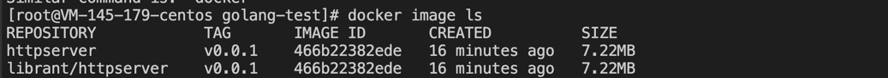
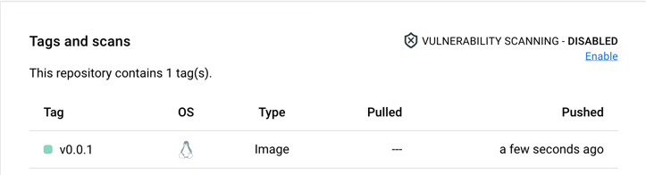

#### 从零开始构建镜像

1、编写源码，编译生成二进制   
2、编写 Dockerfile 文件   
3、根据 Dockerfile 构建镜像   
```shell
docker build . -t httpserver:v0.0.1
```

- 查看编译完成的镜像
```shell
docker image ls
```


4、镜像测试   
```shell
docker run -d -p 12345:8080 --name httpserver-test httpserver:v0.0.1
```

5、推送到远程镜像仓库
```shell
# 给镜像打 tag
docker tag 466b22382ede librant/httpserver:v0.0.1
# 默认推送到 dockerhub 
docker push librant/httpserver:v0.0.1

# https://hub.docker.com/repository/docker/librant/httpserver
```
