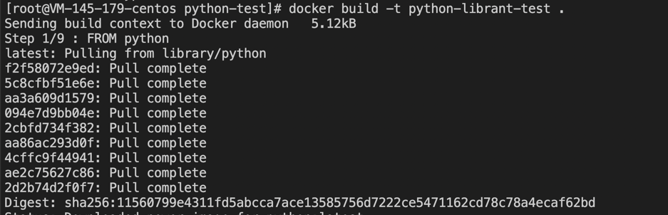
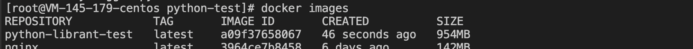
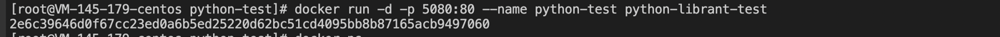
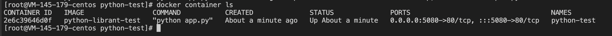
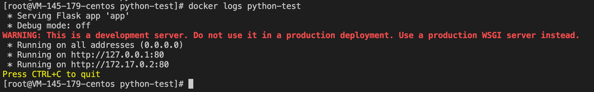
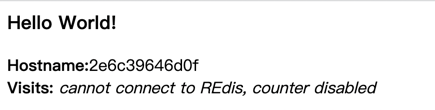
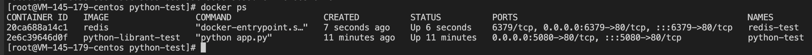

#### 镜像制作步骤

1) 根据 Dockerfile 制作镜像
```shell
# -t，打个标记，等于给这个镜像取个名字
docker build -t python-librant-test .
```


- 查看打包好的镜像
```shell
docker image ls
```


2) 运行容器 python-test
```shell
docker run -d -p 5080:80 --name python-test python-librant-test
```


- 查看运行的容器
```shell
docker container ls
```


- 查看容器运行日志
```shell
docker logs python-test
```


- 查看运行结果
```shell
xx.xx.xx.xx:5080
```


3) 运行容器 redis
```shell
docker run -d -p 6379:80 --name redis-test redis
```


启动 redis 之后，这里页面还是不能链接 redis，因为这里没有配置 redis 的链接地址；

4) 链接 redis 容器
```shell
# 注意，如果用前面的 python 容器名，这里需要先将之前的容器删除
docker run -d --name python-test -p 5080:80 --link redis-test:redis python-librant-test
```

- 再次刷线浏览器， 可以看到链接上 redis 


