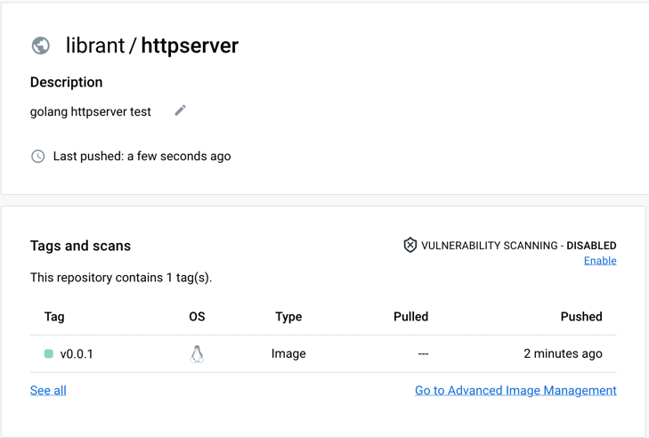
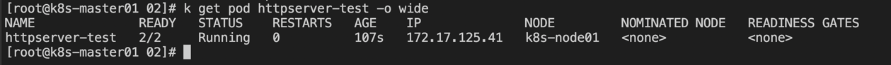
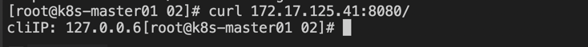
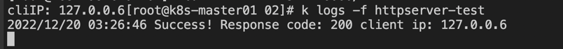

### 第二讲：如何将容器镜像部署到 K8s

---
**前期准备：**
- 已经安装好的 k8s 集群


- 已经创建好的 docker hub 仓库   
[构建镜像参考第一讲：dockerfile-example/daemon-golang]


---
**本节主要内容：**    
- 将构建好的镜像，推到对应的 docker hub 的镜像仓库
- 在 k8s 集群中部署构建好的容器镜像
---

1) 通过 pod 方式部署到集群
```shell
kubectl apply -f httpserver-pod.yaml
```

- 查看部署的 pod 情况
```shell
kubectl get pod httpserver-test -o wide
```


- 通过 curl 命令请求
```shell
curl 172.17.125.41:8080/
```


- 查看 pod 中容器日志
```shell
# 注意，当 pod 中只有一个容器时，不需要指定容器名，否则需要通过 -c 指定
kubectl logs -f httpserver-test
```


2) 环境清理
```shell
kubectl delete -f httpserver-pod.yaml
```
