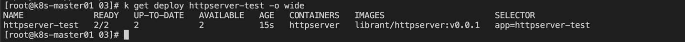
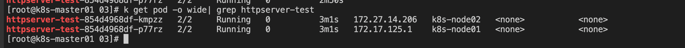
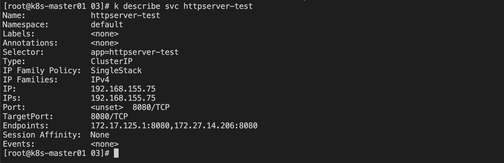
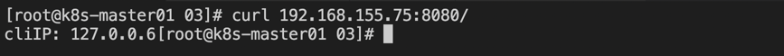
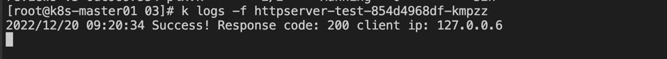
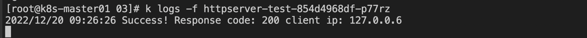
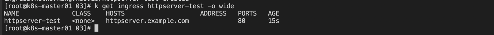
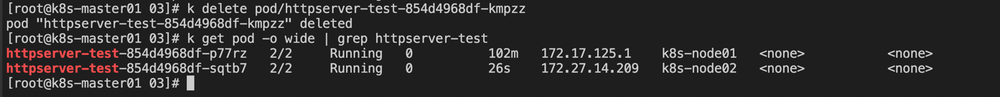
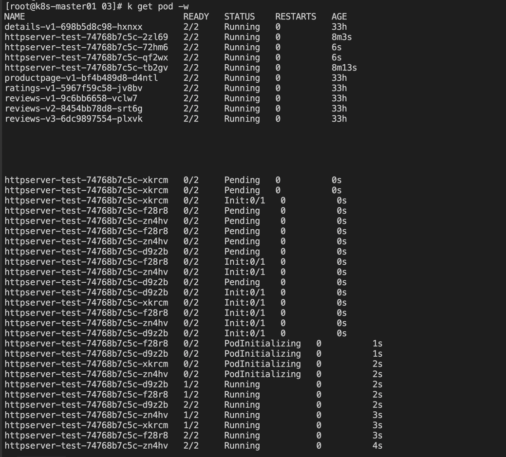
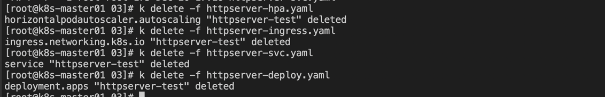

### 第三讲：K8s 如何实现自动扩容和自愈

#### 1、K8s 自动自愈

1) 创建 Deployment 工作负载
```shell
kubectl apply -f httpserver-deploy.yaml 
```

- 查看部署的 deployment 资源
```shell
kubectl get deploy httpserver-test -o wide
```


- 查看部署的 pod 状态
```shell
kubectl get pod -o wide| grep httpserver-test
```


2) 创建服务访问的 service 资源
```shell
kubectl apply -f httpserver-svc.yaml
```

- 查看创建的 service 信息
```shell
kubectl describe svc httpserver-test
```


- 系统分配了 ClusterIP
- 关联后端 Endpoints

3) 通过 ClusterIP:Port 的方式访问
```shell
curl 192.168.155.75:8080/
```


- 查看对应后端 Pod 中的日志



这里可以看到请求被随机分配到后端的两个 Pod 上；

这里需要说明的是，由于搭建的集群安全组没有设置，导致外部无法访问；

4) 创建 Ingress 资源
```shell
kubectl apply -f httpserver-ingress.yaml
```

- 查看 Ingress 创建信息


5) 模拟一个 pod 被删除
```shell
kubectl delete pod/httpserver-test-854d4968df-kmpzz
```


可以看到 Deployment 又重新创建一个新的 Pod 出来

**总结：**
- Pod 会被 Deployment 工作负载管理起来，例如创建和销毁等
- Service 相当于弹性伸缩组的负载均衡器，通过轮询的方式将流量转发到多个 Pod 后端副本上
- Ingress 相当于集群的外网访问入口

#### 2、K8s 自动扩容

1) 通过生成 HPA 资源，控制自动扩缩容
```shell
kubectl apply -f httpserver-hpa.yaml
```
```shell
# 不想创建 HPA 资源，可以通过命令创建
kubectl autoscale deployment httpserver-test --cpu-percent=10 --min=2 --max=10
```

2) 循环执行接口调用，观察 Pod 情况
```shell
while :; do curl 192.168.155.75:8080/; done
```

通过循环调用后端接口，提升 Pod 负载，使其自动扩容

- 观察自动扩容过程
```shell
kubectl get pod -w
```


可以看到 Pod 已经被自动扩容；在负载降低时，又会自动缩容；

3) 环境清理
```shell
kubectl delete -f httpserver-hpa.yaml
kubectl delete -f httpserver-ingress.yaml
kubectl delete -f httpserver-svc.yaml
kubectl delete -f httpserver-deploy.yaml
```



